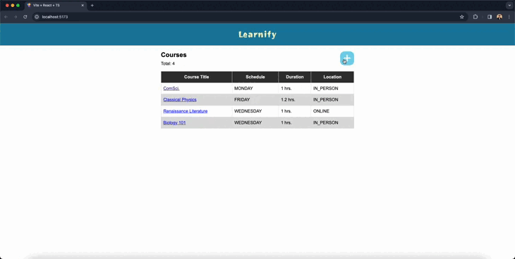

# Course Management System


This is a Course Management System, allowing instructors to view, edit, and delete courses.



## Table of Contents

- [Prerequisites](#prerequisites)
- [Getting Started](#getting-started)
  - [Backend Setup](#backend-setup)
  - [Frontend Setup](#frontend-setup)
- [Running the Application](#running-the-application)
- [Technologies Used](#technologies-used)

## Prerequisites

Before proceeding, ensure you have the following tools installed on your device:

- [Node.js v16 or higher](https://nodejs.org/)
- [MySQL](https://www.mysql.com/)

## Getting Started

Clone this repo and open it in the IDE or Text Editor of your choice.

```bash
git clone git@github.com:menard-codes/Wingaru-Project-Course-Management-App.git
```

### Backend Setup

1. Inside the project folder, go to the `backend` folder and install all the dependencies:

   ```bash
   cd backend
   npm install
   ```

2. Next, make sure you have [MySQL](https://www.mysql.com/downloads/) installed in your computer **and that it's running**. For this step, initiate Prisma.

   ```bash
   npx prisma init --datasource-provider mysql
   ```

3. Then, run a prisma migration to connect Prisma to your MySQL database.

   ```bash
   npx prisma migrate dev --name init
   ```

4. (Optional) You can skip this step if you want a clean and empty database. This step is just a simple seeding of the database so that we have an initial data to work with.

   ```bash
   ts-node prisma/seed.ts
   ```

With all these, the backend is ready to go.

## Frontend Setup

Going back to the project folder you cloned earlier, go to the `frontend` folder and install all the dependencies. It is recommended to use yarn:

```bash
cd frontend
yarn # to install the dependencies

# or use `npm install`
```

## Running the Application

Go back to the `backend` directory and run the server:

```bash
cd backend
npm run dev
```

Do the same thing for the frontend:

```bash
cd frontend
yarn dev # or `npm run dev`
```

## Technologies Used

### Backend

- Node.js
- TypeScript
- Prisma (for ORM)
- Express

### Frontend

- React.js
- TypeScript
- Redux (for State Management)
- SASS (custom styling)
